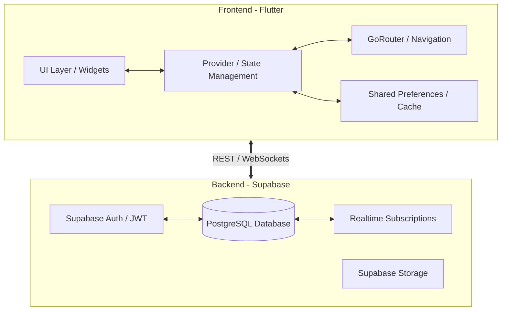
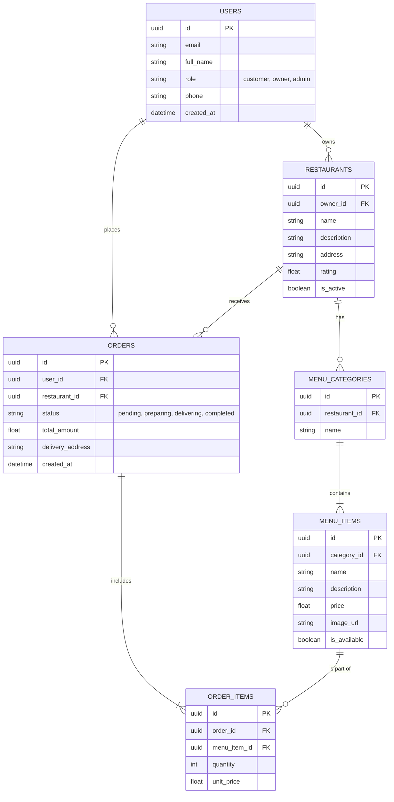

# 2. System Design Document

## 2.1 System Architecture

SaffronEats utilizes a modern, serverless mobile architecture to guarantee scalability and native performance.

### Architectural Choices:
1.  **Flutter:** Chosen for native compilation, smooth 60fps animations, and a unified codebase.
2.  **Provider:** Used for reactive state management (Cart, Auth, Orders) to decouple UI from business logic.
3.  **Supabase:** Provides PostgreSQL, out-of-the-box Authentication, and real-time WebSockets for live order tracking.

---

## 2.2 Database Schema (Entity Relationship Diagram)

---

## 2.3 UI/UX Design & Mockups

The system uses a highly modular UI component strategy:
*   **Color Palette:** Saffron Orange (Primary), Deep Slate (Text/Backgrounds), Off-White (Surfaces).
*   **Typography:** Outfit (Headings) and Inter (Body) for a modern, clean look.
*   **Mockups/Wireframes:** The UI was designed mobile-first. 
    *   *Home Screen:* Features a horizontal category chip bar (`CategoryFilterChip`) and a vertical scrolling list of `RestaurantCard` widgets.
    *   *Menu Screen:* Utilizes sticky headers and `MenuItemCard` with direct "Add" capabilities.
    *   *Cart:* A bottom-sheet style checkout summary with clear taxation and fee breakdowns.
    *   *Dashboards:* The owner dashboard uses `fl_chart` for visual data representation.

*(Note: Live screenshots of the implemented UI can be found in the root `README.md`)*

---

## 2.4 API Design

Since the application uses Supabase, traditional REST API endpoints are replaced with PostgREST queries and Realtime Subscriptions.

**Core Data Access Patterns:**
*   **Auth:** `supabase.auth.signInWithPassword()` / `signUp()`
*   **Fetch Restaurants:** `supabase.from('restaurants').select('*').eq('is_active', true)`
*   **Fetch Menu:** `supabase.from('menu_categories').select('*, menu_items(*)')`
*   **Place Order:** `supabase.from('orders').insert({...})` (Triggers a webhook/function to deduct inventory if necessary).
*   **Live Tracking:** `supabase.channel('public:orders').on('postgres_changes', ...).subscribe()`
